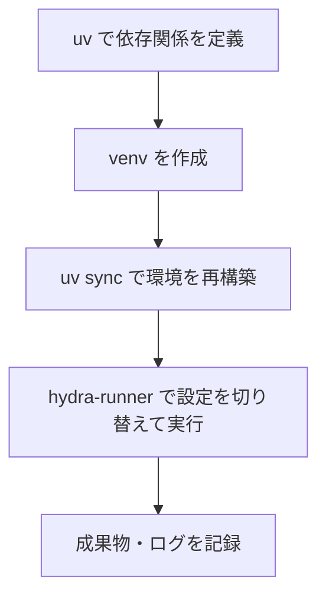

# 構造的管理ガイド

環境構築や実験の実行手順がバラバラだと、再現性が下がりチームでの連携も難しくなります。このセクションでは、Python プロジェクトの土台を整えるためのツール（uv、venv、hydra-runner）の役割と組み合わせ方を整理します。目的に応じて「環境を素早く用意する」「プロジェクトの枠組みを固定する」「設定を切り替えながら実行する」などの作業を可視化し、どこでどのツールを使うと効果的かを示します。

## 全体像

| 作業段階 | 課題 | 主なツール | このセクションで解説するポイント |
| --- | --- | --- | --- |
| 依存関係の同期 | チーム全員が同じバージョンのパッケージを使えるようにする | uv | `uv pip compile` によるロックファイル生成、`uv sync` による高速インストール |
| 実行環境の分離 | プロジェクトごとに独立した Python 実行環境を持つ | venv | 仮想環境の作成・切り替え・破棄の手順、`pyproject.toml` との連携 |
| 実行手順の標準化 | 設定ファイルを切り替えながら再現可能に実験を実行する | hydra-runner | Hydra の設定階層と `--config-name`/`--config-path` オプションの使い分け |

3 つのツールは排他的ではなく、以下のように組み合わせることで再現性の高いフローを構築できます。

1. `uv` で依存関係を固定し、`uv.lock` をバージョン管理する。
2. 開発者ごとに `python -m venv .venv` で仮想環境を作成し、`uv sync --python .venv/bin/python` で依存関係を同期する。
3. Hydra プロジェクトでは `hydra-runner` を使って設定ファイルの差し替えや実行手順をコマンドとして共有する。

## 推奨ワークフロー

各ページでは、導入目的を日常的な言葉で説明しつつ、実際に打つコマンドとファイル構成例を掲載しています。初めて触れる場合でも順序通りに進めればチームメンバーと同じ環境が構築できるよう配慮しています。

## 参考資料

- [uv 公式ドキュメント](https://docs.astral.sh/uv/)
- [Python venv — Python ドキュメント](https://docs.python.org/ja/3/library/venv.html)
- [Hydra — Run your experiments](https://hydra.cc/docs/intro/)
- [hydra-runner — CLI サポートツール](https://github.com/facebookresearch/hydra/tree/main/plugins/hydra_joblib_launcher#hydra-runner)
